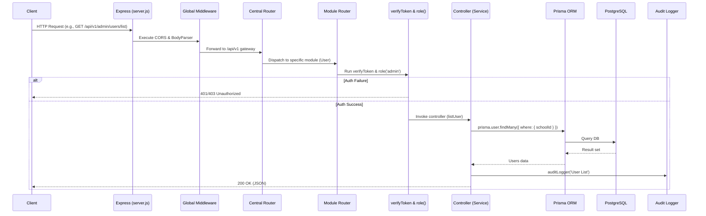

# Complete Vega Backend Flow (Mermaid Diagram)

```mermaid
flowchart TD
    %% Styles
    classDef client fill:#e0f7fa,stroke:#006064,stroke-width:2px;
    classDef server fill:#fff3e0,stroke:#e65100,stroke-width:2px;
    classDef middleware fill:#e8f5e9,stroke:#1b5e20,stroke-width:2px;
    classDef router fill:#f3e5f5,stroke:#4a148c,stroke-width:2px;
    classDef module fill:#ffebee,stroke:#b71c1c,stroke-width:2px;
    classDef db fill:#e3f2fd,stroke:#0d47a1,stroke-width:2px;
    classDef cache fill:#fffde7,stroke:#f57f17,stroke-width:2px;
    classDef audit fill:#f1f8e9,stroke:#33691e,stroke-width:2px;

    %% Nodes
    Client((Web/Mobile Client)):::client
    Server[server.js<br/>Express Application]:::server
    CORS[CORS Middleware]:::middleware
    BodyParser[Body Parser (express.json())]:::middleware
    RedisInit[(Redis Cache<br/>app.locals.redis)]:::cache
    CentralRouter[Central Router<br/>routes/index.js]:::router
    
    subgraph Modules[Module Routers (Bounded Contexts)]
        AuthMod[Auth & Security<br/>modules/auth/routes]:::module
        UserMod[User & Roles<br/>modules/user/routes]:::module
        AcademicMod[Academic<br/>modules/classes, subjects, attendance]:::module
        ExamMod[Examination<br/>modules/exam, results]:::module
        AdminMod[Administration<br/>modules/feeManagement, leaveManagement, notices]:::module
    end
    
    subgraph Security[Security Middleware]
        VerifyToken[verifyToken()]:::middleware
        RoleCheck[role()]:::middleware
    end
    
    Controllers[Controllers / Services]:::server
    Prisma[Prisma ORM Layer]:::db
    Postgres[(PostgreSQL Database)]:::db
    AuditLogger[Audit Logger]:::audit
    
    %% Flow
    Client --> Server
    Server --> CORS
    Server --> BodyParser
    Server -.-> RedisInit
    CORS --> BodyParser
    BodyParser --> CentralRouter
    CentralRouter --> AuthMod
    CentralRouter --> UserMod
    CentralRouter --> AcademicMod
    CentralRouter --> ExamMod
    CentralRouter --> AdminMod
    
    AuthMod --> VerifyToken
    UserMod --> VerifyToken
    AcademicMod --> VerifyToken
    ExamMod --> VerifyToken
    AdminMod --> VerifyToken
    
    VerifyToken --> RoleCheck
    RoleCheck --> Controllers
    
    Controllers --> Prisma
    Controllers --> AuditLogger
    Controllers --> RedisInit
    Prisma --> Postgres
    
    Controllers -->|JSON Response| Client
```

