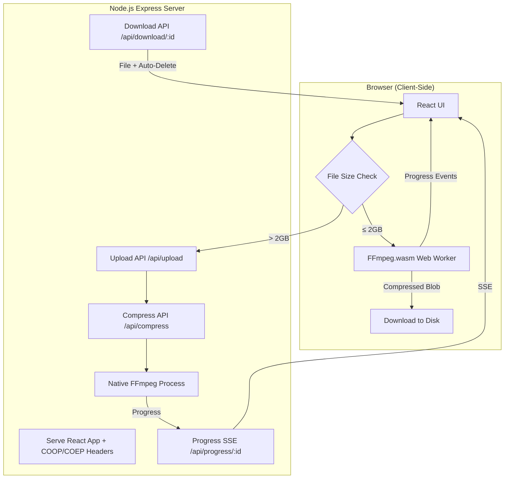

# Video Compression Tool — Implementation Plan

## Goal

Build a production-ready web tool that compresses large video files down to user-selected target sizes (50 / 100 / 200 / 300 MB) while preserving the original resolution and maximum visual quality. Output must play flawlessly on **Windows, LG WebOS Digital Signage, iPhone, and Android DMP/TVs**.

## Tech Stack

| Layer | Technology |
|---|---|
| **Core Compression** | FFmpeg.wasm (`@ffmpeg/ffmpeg`) — client-side WebAssembly |
| **Frontend** | React 19 + TypeScript |
| **Styling** | Tailwind CSS v4 |
| **Build Tool** | Vite 6 |
| **Backend** | Node.js + Express (serves app, sets required headers, fallback for large files) |

---

## User Review Required

> [!IMPORTANT]
> **Hybrid Architecture** — FFmpeg.wasm runs entirely in the browser, which is great for privacy (no upload needed). However, it has a practical **~2 GB file size limit** due to WebAssembly memory constraints. For files larger than 2 GB, I'll implement a **Node.js backend fallback** that uploads the file to the server and uses **native FFmpeg** (already installed on your system) for compression. **Is this hybrid approach acceptable?**

> [!IMPORTANT]
> **Codec Choice: H.264 (AVC) as default** — For universal playback across all your target devices (LG WebOS, iPhone, Android, Windows), H.264 in MP4 with AAC audio is the safest. I'll add an optional H.265 toggle for users who know their device supports it. **Confirmed?**

> [!WARNING]
> **Browser Performance** — FFmpeg.wasm runs at roughly 10-20% of native FFmpeg speed. A 1 GB file might take 15-30+ minutes to compress in-browser depending on CPU. The UI will show real-time progress. For faster processing of large files, the Node.js backend fallback uses native FFmpeg at full speed.

> [!WARNING]
> **SharedArrayBuffer Requirement** — FFmpeg.wasm multi-threading requires `Cross-Origin-Opener-Policy: same-origin` and `Cross-Origin-Embedder-Policy: require-corp` HTTP headers. The Node.js Express server will set these automatically. This means the app **must be served via the Node.js server**, not directly from XAMPP/Apache.

---

## Architecture Overview



### Key Design Decisions

| Decision | Choice | Rationale |
|---|---|---|
| **Small files (≤ 2GB)** | FFmpeg.wasm in browser | No upload needed, instant privacy, zero server load |
| **Large files (> 2GB)** | Upload → Node.js → native FFmpeg | Browser memory limits prevent wasm processing |
| **Encoding method** | Two-pass ABR with calculated bitrate | Precise target file size with optimal quality |
| **Video codec** | H.264 (`libx264`) default, H.265 optional | Universal device compatibility |
| **Audio codec** | AAC 128 kbps, 48 kHz | Universal support |
| **Container** | MP4 with `-movflags +faststart` | Streaming-ready, LG WebOS compatible |
| **Pixel format** | `yuv420p` | Required by all target devices |
| **Progress tracking** | FFmpeg.wasm `progress` event / SSE for server | Real-time feedback |
| **Cleanup** | Browser: memory freed after download. Server: source deleted after compression, output deleted after download | Zero residual disk usage |

---

## Proposed Changes

### Project Structure

```
c:\xampp\htdocs\internal-tools\video-compressor\
├── package.json                 # Project dependencies & scripts
├── vite.config.ts              # Vite config with COOP/COEP headers
├── tailwind.config.ts          # Tailwind CSS v4 config (if needed)
├── tsconfig.json               # TypeScript config
├── tsconfig.node.json          # TypeScript config for Node.js server
├── index.html                  # Vite entry HTML
│
├── public/                     # Static assets
│
├── src/                        # React frontend
│   ├── main.tsx                # React entry point
│   ├── App.tsx                 # Main app component with state machine
│   ├── index.css               # Tailwind imports + custom styles
│   │
│   ├── components/
│   │   ├── DropZone.tsx        # Drag-and-drop file upload area
│   │   ├── VideoInfo.tsx       # Displays video metadata
│   │   ├── TargetSizeSelector.tsx  # 50/100/200/300 MB card selector
│   │   ├── CodecSelector.tsx   # H.264 / H.265 toggle
│   │   ├── ProgressBar.tsx     # Animated compression progress
│   │   ├── DownloadCard.tsx    # Download button + file info
│   │   └── Header.tsx          # App header/branding
│   │
│   ├── hooks/
│   │   ├── useFFmpeg.ts        # FFmpeg.wasm initialization & operations
│   │   ├── useVideoInfo.ts     # Extract video metadata via ffprobe.wasm
│   │   └── useServerCompress.ts # Server-side compression for large files
│   │
│   ├── lib/
│   │   ├── ffmpeg-worker.ts    # FFmpeg.wasm worker setup
│   │   ├── compression.ts      # Two-pass encoding logic & bitrate calc
│   │   ├── fileUtils.ts        # File size formatting, validation
│   │   └── types.ts            # TypeScript interfaces
│   │
│   └── assets/                 # Icons, images
│
├── server/
│   ├── index.ts                # Express server entry
│   ├── routes/
│   │   ├── upload.ts           # Chunked upload handler
│   │   ├── compress.ts         # Native FFmpeg compression
│   │   ├── progress.ts         # SSE progress endpoint
│   │   └── download.ts         # File serve + auto-cleanup
│   ├── lib/
│   │   ├── ffmpeg.ts           # Native FFmpeg process manager
│   │   └── cleanup.ts          # File cleanup utilities
│   └── uploads/                # Temp upload storage (auto-cleaned)
│   └── compressed/             # Temp output storage (auto-cleaned)
│
└── .gitignore
```

---

### Frontend Components

#### [NEW] `src/App.tsx`

Main application component implementing a state machine:

```
IDLE → FILE_SELECTED → ANALYZING → READY → COMPRESSING → DONE → DOWNLOADED
```

- Manages global state: selected file, video metadata, target size, codec, progress, compressed output
- Routes to client-side (FFmpeg.wasm) or server-side compression based on file size
- Handles all error states gracefully

#### [NEW] `src/components/DropZone.tsx`

- Full-width drag-and-drop area with animated dashed border
- Click-to-browse file picker fallback
- Validates video MIME types (video/mp4, video/webm, video/avi, video/mov, video/mkv, etc.)
- Shows file name, size, and thumbnail preview
- Animated file icon on hover/drop

#### [NEW] `src/components/TargetSizeSelector.tsx`

- Four selectable cards: 50 MB, 100 MB, 200 MB, 300 MB
- Each card shows estimated quality rating (based on source duration/resolution)
- Disabled cards if target > source file size
- Glassmorphism card style with glow on selection

#### [NEW] `src/components/CodecSelector.tsx`

- Toggle switch: H.264 (default) / H.265
- H.265 shows a warning tooltip: "May not play on all devices"
- Pill-style toggle with smooth animation

#### [NEW] `src/components/ProgressBar.tsx`

- Dual-phase progress: Pass 1 (Analysis) → Pass 2 (Encoding)
- Animated gradient fill with glow effect
- Shows: percentage, current pass, FPS, estimated time remaining
- Pulsing animation during processing

#### [NEW] `src/components/DownloadCard.tsx`

- Appears when compression is complete
- Shows: original size vs compressed size, compression ratio, savings percentage
- Large download button with animated icon
- "Memory will be freed after download" notice
- After download: shows "Cleaned up successfully" confirmation

#### [NEW] `src/components/VideoInfo.tsx`

- Displays extracted video metadata in a clean grid
- Fields: Resolution, Duration, Codec, Bitrate, Frame Rate, File Size
- Extracted via ffprobe.wasm (client-side) for small files, or API for server path

---

### Core Logic

#### [NEW] `src/hooks/useFFmpeg.ts`

```typescript
// Key functionality:
// - Lazy-loads @ffmpeg/ffmpeg and @ffmpeg/core-mt
// - Initializes FFmpeg.wasm with multi-threading
// - Exposes: load(), compress(file, targetSizeMB, codec), progress state
// - Two-pass encoding via sequential ffmpeg.exec() calls
// - Automatic memory cleanup after download
```

#### [NEW] `src/lib/compression.ts`

Two-pass ABR encoding logic:

```typescript
// Bitrate calculation:
// audioBitrate = 128_000  // 128 kbps AAC
// targetBits = targetSizeMB * 8 * 1024 * 1024
// videoBitrate = Math.floor((targetBits / durationSeconds) - audioBitrate)
// videoBitrate = Math.floor(videoBitrate * 0.98) // 2% container overhead margin

// Pass 1 command (analysis):
// -y -i input.mp4 -c:v libx264 -b:v {videoBitrate} -pass 1
// -preset slow -profile:v high -level 4.1 -pix_fmt yuv420p
// -an -f null /dev/null (or NUL on server)

// Pass 2 command (encoding):
// -y -i input.mp4 -c:v libx264 -b:v {videoBitrate} -pass 2
// -preset slow -profile:v high -level 4.1 -pix_fmt yuv420p
// -movflags +faststart -c:a aac -b:a 128k -ar 48000
// output.mp4
```

#### [NEW] `src/hooks/useServerCompress.ts`

For files > 2 GB:
- Chunked upload (5 MB chunks) with progress tracking
- Starts compression via POST `/api/compress`
- Connects to SSE `/api/progress/:id` for real-time updates
- Downloads result and triggers server cleanup

---

### Backend (Node.js + Express)

#### [NEW] `server/index.ts`

Express server:
- Sets COOP/COEP headers for SharedArrayBuffer support
- Serves Vite-built static files in production
- Development proxy to Vite dev server
- Routes for upload, compress, progress, download
- Port: 3001 (configurable)

#### [NEW] `server/routes/upload.ts`

- Accepts chunked file uploads via `multipart/form-data`
- Merges chunks into single file in `server/uploads/`
- Returns job ID (UUID) for tracking
- Validates video MIME types

#### [NEW] `server/routes/compress.ts`

- Receives job ID, target size, codec choice
- Probes video with `ffprobe` for duration/metadata
- Calculates target bitrate
- Spawns native FFmpeg two-pass process
- Writes progress to file for SSE endpoint
- Deletes source file after successful compression

#### [NEW] `server/routes/progress.ts`

- SSE endpoint streaming FFmpeg progress
- Parses FFmpeg `-progress pipe:1` output
- Sends: `{ percent, pass, fps, bitrate, eta, status }`

#### [NEW] `server/routes/download.ts`

- Streams compressed file to client
- Deletes file after successful transfer
- Returns 404 if already cleaned

---

### Build & Configuration

#### [NEW] `vite.config.ts`

```typescript
// - React plugin
// - Set COOP/COEP headers in dev server
// - Optimize deps for @ffmpeg/ffmpeg, @ffmpeg/core-mt
// - Configure server proxy to Node.js backend (/api → 3001)
```

#### [NEW] `package.json`

Key dependencies:
```json
{
  "dependencies": {
    "@ffmpeg/ffmpeg": "^0.12.15",
    "@ffmpeg/core": "^0.12.9",
    "@ffmpeg/core-mt": "^0.12.9",
    "@ffmpeg/util": "^0.12.2",
    "react": "^19.0.0",
    "react-dom": "^19.0.0",
    "express": "^5.0.0",
    "multer": "^2.0.0",
    "uuid": "^11.0.0",
    "cors": "^2.8.5"
  },
  "devDependencies": {
    "@vitejs/plugin-react": "^4.3.0",
    "tailwindcss": "^4.0.0",
    "@tailwindcss/vite": "^4.0.0",
    "typescript": "^5.7.0",
    "tsx": "^4.0.0",
    "concurrently": "^9.0.0",
    "@types/react": "^19.0.0",
    "@types/express": "^5.0.0",
    "vite": "^6.0.0"
  }
}
```

Scripts:
```json
{
  "dev": "concurrently \"vite\" \"tsx watch server/index.ts\"",
  "build": "vite build",
  "start": "node dist/server/index.js",
  "preview": "vite preview"
}
```

---

## UI Design

### Color Palette

| Token | Value | Usage |
|---|---|---|
| Background | `#06060a` → `#0f0f1a` | Page background gradient |
| Surface | `rgba(255,255,255,0.03)` | Card backgrounds |
| Surface Hover | `rgba(255,255,255,0.06)` | Hover states |
| Border | `rgba(255,255,255,0.08)` | Card borders |
| Primary | `#3b82f6` → `#8b5cf6` | Blue-violet gradient accent |
| Success | `#10b981` | Completion states |
| Warning | `#f59e0b` | H.265 compatibility warning |
| Text Primary | `#f1f5f9` | Main text |
| Text Secondary | `#64748b` | Labels, hints |

### Typography

- **Font**: Inter (Google Fonts)
- **Headings**: Bold, tracking-tight
- **Body**: Regular weight, relaxed line height

### Layout

Single-page, centered column layout (~800px max width):
1. **Header** — App name + brief description
2. **Drop Zone** — Large drag-drop area
3. **Video Info** — Metadata grid (hidden until file selected)
4. **Target Size** — 4 selectable cards in a row
5. **Codec Toggle** — Below target size
6. **Compress Button** — Full-width CTA
7. **Progress Bar** — Replaces button during compression
8. **Download Card** — Appears when done

---

## Compatibility Flags Reference

| FFmpeg Flag | Purpose |
|---|---|
| `-profile:v high -level 4.1` | H.264 High Profile, supports up to 1080p60 |
| `-pix_fmt yuv420p` | Required by LG WebOS, iPhone, most Android |
| `-movflags +faststart` | MP4 moov atom at front for streaming playback |
| `-c:a aac -ar 48000` | AAC audio at 48kHz, universally supported |
| `-tag:v hvc1` | (H.265 only) Required for iPhone HEVC playback |
| `-preset slow` | Better quality per bit (worth the extra time) |

---

## Open Questions

> [!IMPORTANT]
> 1. **Hybrid approach** — Client-side FFmpeg.wasm for ≤ 2GB, server-side native FFmpeg for > 2GB. Is this acceptable?
> 2. **Port** — Node.js server on port 3001 by default. Should I use a different port?
> 3. **Authentication** — Should access be unrestricted, or add a PIN/password?
> 4. **Tailwind CSS version** — I'll use Tailwind CSS v4 (latest, CSS-first config). Confirmed?

---

## Verification Plan

### Automated Tests
1. Build the Vite project successfully (`npm run build`)
2. Start dev server and verify COOP/COEP headers are set
3. Load FFmpeg.wasm in browser without errors
4. Compress a test video to each target size and verify output is within ±5% of target
5. Verify compressed output metadata (codec, container, pixel format) via ffprobe
6. Test server-side compression pipeline end-to-end
7. Verify cleanup: browser memory freed, server files deleted

### Manual Verification
- Visual quality spot-check of compressed output
- Test playback on target devices (Windows, LG WebOS, iPhone, Android)
- Test UI responsiveness on mobile viewport
- Stress test with files near the 2GB boundary
